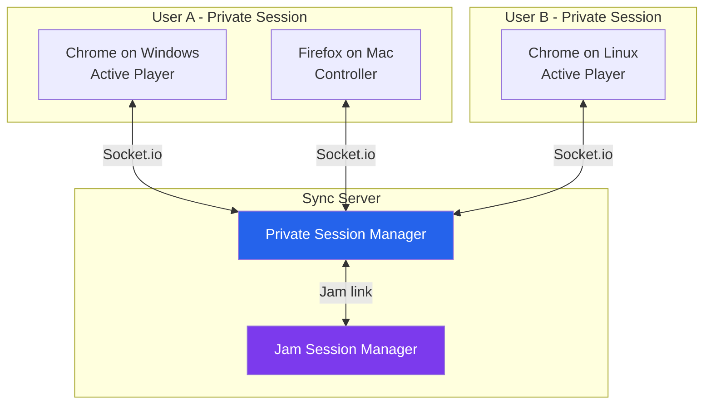
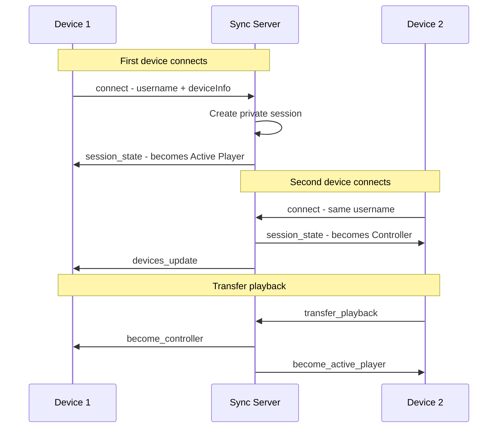
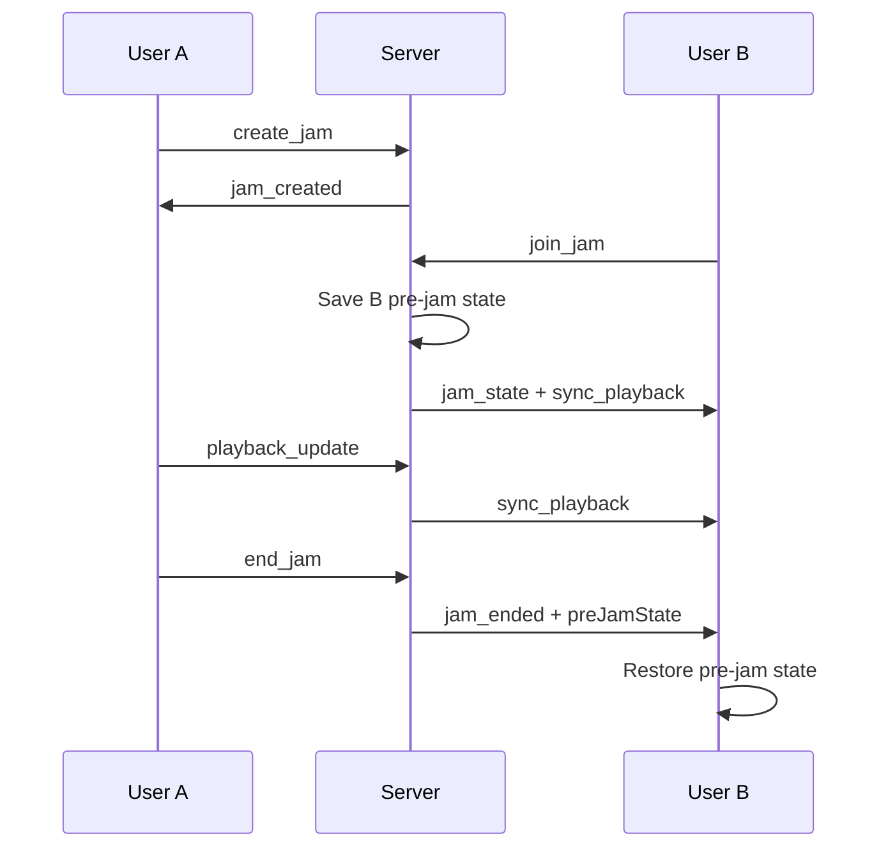

# Aonsoku Connect — Architecture Design

> A Connect-like session system for Aonsoku: automatic per-user device sync with optional multi-user Jam sessions layered on top.

---

## Table of Contents

1. [System Overview](#1-system-overview)
2. [Backend Protocol](#2-backend-protocol)
3. [Frontend State](#3-frontend-state)
4. [Frontend Service](#4-frontend-service)
5. [UI Components](#5-ui-components)
6. [Migration Path](#6-migration-path)
7. [Edge Cases](#7-edge-cases)
8. [Implementation Order](#8-implementation-order)

---

## 1. System Overview

### 1.1 Core Concepts

| Concept | Description |
|---------|-------------|
| **Private Session** | Automatic, per-user session existing whenever >= 1 device is connected. Keyed by `serverUrl::username`. All devices of a single user share playback state. |
| **Device** | A browser tab, Electron window, or mobile client. Has a persistent `deviceId` (localStorage) and human-readable name. |
| **Active Player** | The device outputting audio. One by default; user can transfer it. |
| **Controller** | A connected device that sees playback state and can issue commands but does not play audio. |
| **Jam Session** | Public, multi-user session layered on top of private sessions. When active, jam state overrides private session state. |

### 1.2 High-Level Architecture



### 1.3 Session Lifecycle



### 1.4 Jam Session Overlay

When a user creates or joins a Jam, their private session is "linked" to the jam. The jam's playback state overrides the private session. When the jam ends, each user's pre-jam state is restored.



---

## 2. Backend Protocol

### 2.1 Server Data Structures

```typescript
interface Device {
  socketId: string
  deviceId: string        // Persistent, from client localStorage
  deviceName: string      // e.g. "Chrome on Windows"
  isActivePlayer: boolean
  connectedAt: number
  lastSeen: number
}

interface PrivateSession {
  username: string
  sessionKey: string      // `${serverUrl}::${username}`
  devices: Device[]
  playbackState: PlaybackState | null
  activePlayerDeviceId: string | null
  linkedJamId: string | null
}

interface PlaybackState {
  songId: string
  isPlaying: boolean
  progress: number
  timestamp: number
  queue: SongData[]
  currentIndex: number
  loopState: number
  isShuffleActive: boolean
}

interface JamSession {
  jamId: string
  hostSessionKey: string
  linkedSessionKeys: string[]
  playbackState: PlaybackState | null
  canGuestsControl: boolean
  preJamStates: Map<string, PlaybackState>
}

// Server maps
const privateSessions = new Map()   // sessionKey -> PrivateSession
const jamSessions = new Map()       // jamId -> JamSession
const socketToSession = new Map()   // socketId -> sessionKey
const socketToDevice = new Map()    // socketId -> deviceId
```

### 2.2 Connection Handshake

Client connects with query params:
- `username` — from `useAppStore.data.username`
- `deviceId` — persistent UUID from localStorage
- `deviceName` — auto-detected from user agent
- `serverUrl` — Navidrome server URL (prevents cross-server collisions)

**Session key**: `${serverUrl}::${username}`

### 2.3 Socket.io Events — Client to Server

| Event | Payload | Description |
|-------|---------|-------------|
| *(connection)* | Query params | Auto-joins/creates private session |
| `playback_update` | `PlaybackState` | Active player reports state |
| `transfer_playback` | `{ targetDeviceId }` | Move playback to another device |
| `request_play_here` | — | This device wants to become active player |
| `command` | `{ action, payload? }` | Remote command to active player |
| `heartbeat` | — | Keep-alive every 30s |
| `create_jam` | — | Create jam, become host |
| `join_jam` | `{ jamId }` | Join existing jam |
| `leave_jam` | — | Leave current jam |
| `end_jam` | — | Host ends jam for all |
| `set_jam_guest_control` | `{ canControl }` | Host toggles guest control |

### 2.4 Socket.io Events — Server to Client

| Event | Payload | Description |
|-------|---------|-------------|
| `session_state` | `{ devices, playbackState, activePlayerDeviceId, jam }` | Full sync on connect |
| `devices_update` | `Device[]` | Device list changed |
| `sync_playback` | `PlaybackState` | State update for controllers/jam guests |
| `become_active_player` | `{ playbackState }` | Start audio output |
| `become_controller` | — | Stop audio output |
| `remote_command` | `{ action, payload? }` | Execute command on active player |
| `jam_created` | `{ jamId }` | Jam created |
| `jam_state` | `{ jamId, participants, playbackState, canGuestsControl, isHost }` | Full jam state |
| `jam_participants_update` | `JamParticipant[]` | Jam participants changed |
| `jam_guest_control_update` | `{ canGuestsControl }` | Guest control toggled |
| `jam_ended` | `{ preJamState }` | Jam ended, restore state |
| `error` | `{ code, message }` | Error |

### 2.5 Server Logic — Connection

```
ON connection(socket):
  1. Extract username, deviceId, deviceName, serverUrl from query
  2. Validate; disconnect if missing
  3. sessionKey = `${serverUrl}::${username}`
  4. Record socketId -> sessionKey and socketId -> deviceId
  5. IF session exists:
       Add device, send session_state, broadcast devices_update
     ELSE:
       Create session, add device as activePlayer, send session_state
  6. Join room `private:${sessionKey}`
  7. IF session.linkedJamId: also join `jam:${jamId}`, include jam in session_state
```

### 2.6 Server Logic — Playback Update

```
ON playback_update(socket, data):
  1. Find session for socket
  2. IF user in jam:
       IF host OR canGuestsControl: update jam state, broadcast to jam room
     ELSE:
       IF device is activePlayer: update session state, broadcast to private room
```

### 2.7 Server Logic — Transfer Playback

```
ON transfer_playback(socket, { targetDeviceId }):
  1. Find session, find target device
  2. Set old active player -> isActivePlayer = false
  3. Set target -> isActivePlayer = true
  4. Emit become_controller to old, become_active_player to target
  5. Broadcast devices_update

ON request_play_here(socket):
  Same as transfer_playback with targetDeviceId = this device
```

### 2.8 Server Logic — Remote Commands

```
ON command(socket, { action, payload }):
  1. Find session, check jam permissions
  2. Find active player device
  3. Forward remote_command to active player socket

  Actions: play, pause, togglePlayPause, next, prev,
           seek { position }, setVolume { volume }
```

### 2.9 Heartbeat and Cleanup

- Client sends `heartbeat` every 30s; server updates `device.lastSeen`
- Server runs cleanup every 60s: removes stale devices (lastSeen > 90s ago + disconnected)
- If active player removed: promote next device or set null
- If no devices remain: delete session
- If jam host session deleted: end jam for all

### 2.10 Jam Session Logic

```
ON create_jam: Generate jamId, create JamSession, link host session, emit jam_created
ON join_jam: Save preJamState, link session, join jam room, emit jam_state
ON leave_jam: Unlink session, emit jam_ended with preJamState, leave jam room
ON end_jam: For each linked session: emit jam_ended with preJamState, delete jam
ON set_jam_guest_control: Verify host, update, broadcast
```

---

## 3. Frontend State

### 3.1 New Store: `connect.store.ts`

Manages private session and device state. Separate from the jam store.

```typescript
// src/store/connect.store.ts
interface IDevice {
  deviceId: string
  deviceName: string
  isActivePlayer: boolean
  isCurrentDevice: boolean  // computed by comparing with currentDeviceId
}

interface IConnectSession {
  isConnected: boolean
  isConnecting: boolean
  error: string | null
  devices: IDevice[]
  currentDeviceId: string
  activePlayerDeviceId: string | null
  isActivePlayer: boolean       // derived: is THIS device active?
  hasMultipleDevices: boolean   // derived: devices.length > 1
  inJam: boolean
  jamId: string | null
}

interface IConnectActions {
  setConnected: (value: boolean) => void
  setConnecting: (value: boolean) => void
  setError: (error: string | null) => void
  setDevices: (devices: IDevice[]) => void
  setActivePlayerDeviceId: (deviceId: string | null) => void
  setInJam: (jamId: string | null) => void
  reset: () => void
}
```

**Persistence**: Only `currentDeviceId` is persisted. Everything else is ephemeral.

**Key selector hooks**:
- `useConnectState()` — all connection/device state
- `useIsActivePlayer()` — boolean for this device
- `useConnectedDevices()` — device list

### 3.2 Modified Store: `jam.store.ts`

Simplified — connection state moves to `connect.store.ts`:

```typescript
interface IJamSession {
  jamId: string | null
  participants: IJamParticipant[]
  isHost: boolean               // renamed from isLead
  canGuestsControl: boolean
  syncThreshold: number
}
// Removed: isConnecting, isConnected, error (-> connect.store.ts)
// Removed: lastLeadState (server is source of truth)
// Renamed: isLead -> isHost
```

### 3.3 Player Store Integration

The jam sync subscriptions at the bottom of [`player.store.ts`](src/store/player.store.ts:1383) need modification:

**Key change**: Guard emissions with `isActivePlayer` check and use `connectService` instead of `jamService`:

```typescript
// Song/play state change — immediate emit
usePlayerStore.subscribe(
  (state) => ({ songId: state.songlist.currentSong?.id, isPlaying: state.playerState.isPlaying }),
  () => {
    if (connectService.isSyncing) return
    if (!useConnectStore.getState().isActivePlayer) return  // NEW
    connectService.emitPlaybackState()
  },
  { equalityFn: shallow }
)

// Progress/queue change — throttled emit
let lastProgressEmit = 0
usePlayerStore.subscribe(
  (state) => ({ progress: state.playerProgress.progress, currentList: state.songlist.currentList }),
  () => {
    if (connectService.isSyncing) return
    if (!useConnectStore.getState().isActivePlayer) return  // NEW
    const now = Date.now()
    if (now - lastProgressEmit > 1000) {
      connectService.emitPlaybackState()
      lastProgressEmit = now
    }
  },
  { equalityFn: shallow }
)
```

### 3.4 Device ID Utility

```typescript
// src/utils/deviceId.ts
import { browserName, osName } from 'react-device-detect'
import { isDesktop } from './desktop'

const DEVICE_ID_KEY = 'aonsoku_device_id'

export function getOrCreateDeviceId(): string {
  let id = localStorage.getItem(DEVICE_ID_KEY)
  if (!id) {
    id = crypto.randomUUID()
    localStorage.setItem(DEVICE_ID_KEY, id)
  }
  return id
}

export function getDeviceName(): string {
  if (isDesktop()) return `Aonsoku Desktop on ${osName}`
  return `${browserName} on ${osName}`
}
```

---

## 4. Frontend Service

### 4.1 New Service: `ConnectService` (`src/service/connect.ts`)

Owns the Socket.io connection. Replaces `JamService` as the primary sync service.

**Key responsibilities**:
- Auto-connect on app load when user is authenticated
- Manage socket lifecycle, heartbeat, reconnection
- Emit playback state (active player only)
- Handle remote sync (controllers)
- Handle `become_active_player` / `become_controller` transitions
- Handle remote commands
- Delegate jam events to `JamService`
- Expose `transferPlayback()`, `requestPlayHere()`, `sendCommand()`

**Core methods**:

| Method | Description |
|--------|-------------|
| `autoConnect()` | Called on app load; creates socket with user credentials + device info |
| `emitPlaybackState()` | Sends current player state to server (active player only) |
| `transferPlayback(deviceId)` | Request server to move playback to target device |
| `requestPlayHere()` | This device wants to become active player |
| `sendCommand(action, payload?)` | Send remote command to active player |
| `applyPlaybackState(state)` | Apply received state to player store (used by sync + jam) |
| `disconnect()` | Clean disconnect, stop heartbeat, reset store |

**Event handling**:

| Server Event | Handler |
|-------------|---------|
| `session_state` | Set devices, active player, apply playback if controller, restore jam if linked |
| `devices_update` | Update device list in connect store |
| `sync_playback` | Apply playback state (controllers only, or jam participants) |
| `become_active_player` | Set this device as active, apply state, start audio |
| `become_controller` | Pause audio, update store |
| `remote_command` | Execute play/pause/next/prev/seek on local player |
| `jam_*` events | Delegate to `jamService.handle*()` methods |

**Auto-reconnect**: Socket.io built-in reconnection with exponential backoff (1s to 30s, max 10 attempts).

**Heartbeat**: `setInterval` every 30s emitting `heartbeat` event.

### 4.2 Simplified `JamService` (`src/service/jam.ts`)

No longer owns a socket. Becomes a handler for jam-specific events:

| Method | Description |
|--------|-------------|
| `handleJamCreated(data)` | Update jam store with jamId, set as host |
| `handleJamState(data)` | Full jam state restore on join |
| `handleParticipantsUpdate(data)` | Update participant list |
| `handleGuestControlUpdate(data)` | Update guest control flag |
| `handleJamEnded(data)` | Reset jam store, restore pre-jam state, fire custom event |
| `createSession()` | Delegates to `connectService.createJam()` |
| `joinSession(jamId)` | Delegates to `connectService.joinJam(jamId)` |
| `leaveSession()` | Delegates to `connectService.leaveJam()` |
| `endSession()` | Delegates to `connectService.endJam()` |
| `setGuestControl(v)` | Delegates to `connectService.setJamGuestControl(v)` |

### 4.3 Auto-Connect Hook

```typescript
// src/app/hooks/use-auto-connect.ts
export function useAutoConnect() {
  useEffect(() => {
    const { isServerConfigured } = useAppStore.getState().data
    if (isServerConfigured) {
      connectService.autoConnect()
    }
    return () => connectService.disconnect()
  }, [])
}
```

Called in [`BaseLayout`](src/app/layout/base.tsx) — the root layout for all authenticated routes.

### 4.4 Controller Drift Prevention

The existing drift-correction logic in [`JamService`](src/service/jam.ts:29) (snapping guests back to lead song) is generalized:

- **Private session controllers**: If a controller device manually changes song, it should NOT snap back — the user might be browsing. Only the active player's state is authoritative for sync.
- **Jam guests without control**: Keep the existing snap-back behavior — guests who drift from the host song are corrected.

---

## 5. UI Components

### 5.1 Device Picker Button

**File**: `src/app/components/player/device-picker.tsx`

**Location in player bar**: Between volume control and jam button.

```
┌──────────────────────────────────────────────────────┐
│  ◄◄  ▶  ►►  │  Song Title - Artist  │  🔊  📱  👥  │
│              │  ━━━━━━━━━━━━━━━━━━━  │  vol  dev jam │
└──────────────────────────────────────────────────────┘
```

**Popover content** (shown on click):

```
┌──────────────────────────────────┐
│  Current device                  │
│                                  │
│  🔊 Chrome on Windows    ← You  │
│     ● Now playing                │
│                                  │
│  Other devices                   │
│                                  │
│  💻 Firefox on Mac               │
│     [Play here]                  │
│                                  │
│  💻 Electron App                 │
│     [Play here]                  │
└──────────────────────────────────┘
```

**Behavior**:
- Shows all connected devices for the current user
- Green dot on the active player device
- "Play here" triggers `connectService.transferPlayback(deviceId)`
- Hidden when only one device is connected (or show as disabled)
- Icon pulses when another device is the active player

### 5.2 Controller Mode Banner

**File**: `src/app/components/player/controller-banner.tsx`

Shown above the player bar when this device is a controller:

```
┌──────────────────────────────────────────────────────┐
│  🔇 Playing on "Chrome on Windows"    [Play here]   │
└──────────────────────────────────────────────────────┘
```

- Shows which device is currently playing
- Quick "Play here" button to transfer playback
- Dismissible but reappears on device change

### 5.3 Modified Jam Button

The existing [`JamButton`](src/app/components/player/jam-button.tsx) is simplified:
- Remove connection state display (now in connect store)
- Keep jam-specific UI: create/join/leave, participant list, guest control, sync threshold
- Add visual indicator when in a jam that private session is overridden
- Rename "Lead" to "Host" throughout

### 5.4 Connect Status Indicator (Optional)

Small indicator in the header showing multi-device status:
- Hidden when only 1 device connected
- Shows "2 devices connected" badge when multiple
- Click opens device picker

### 5.5 Component Tree Changes

```
BaseLayout (calls useAutoConnect hook)
├── Header
│   └── ConnectStatusBadge (NEW - optional, shows with 2+ devices)
├── Player
│   ├── PlayerControls (existing)
│   ├── ProgressBar (existing)
│   ├── VolumeControl (existing)
│   ├── DevicePicker (NEW)
│   ├── JamButton (MODIFIED)
│   └── ControllerBanner (NEW - conditional)
└── ...
```

---

## 6. Migration Path

The migration is designed to be **incremental** — each phase is independently deployable and backward-compatible with the previous state.

### Phase 0: Preparation (No Breaking Changes)

1. **Create `src/utils/deviceId.ts`** — New utility file. No existing code touched.
2. **Create `src/store/connect.store.ts`** — New store. No existing code touched.
3. **Create `src/service/connect.ts`** skeleton — New service with empty methods. No existing code touched.

### Phase 1: Backend Evolution

4. **Refactor [`jam-sync-server/index.js`](jam-sync-server/index.js)** — The server must support both the old protocol (for existing jam clients) and the new protocol simultaneously during transition:
   - Add private session management alongside existing jam sessions
   - Accept new query params (`deviceId`, `deviceName`, `serverUrl`) while still accepting old ones (`sessionId`, `isLead`)
   - **Detection**: If `deviceId` is present in query → new protocol (private session). If `sessionId` is present → legacy protocol (jam only).
   - Add new events (`transfer_playback`, `request_play_here`, `command`, `heartbeat`)
   - Keep existing events working (`playback_update`, `leave_session`, `end_session`, `set_guest_control`)

5. **Add heartbeat and cleanup** — Server-side interval for stale device removal.

### Phase 2: Frontend Connect Layer

6. **Implement `ConnectService`** — Full implementation of auto-connect, device management, playback sync.
7. **Add `useAutoConnect` hook** to [`BaseLayout`](src/app/layout/base.tsx).
8. **Modify player store subscriptions** — Replace `jamService` references with `connectService`, add `isActivePlayer` guards.

### Phase 3: Frontend UI

9. **Create `DevicePicker` component** — Device list popover.
10. **Create `ControllerBanner` component** — Banner for controller devices.
11. **Add components to Player** — Wire into the player bar layout.

### Phase 4: Jam Migration

12. **Refactor `JamService`** — Remove socket ownership, delegate to `ConnectService`.
13. **Simplify `jam.store.ts`** — Remove connection state fields.
14. **Update `JamButton`** — Use new store structure, rename Lead→Host.
15. **Update [`JamJoin`](src/app/pages/jam/join.tsx) page** — Use `connectService.joinJam()` instead of `jamService.joinSession()`.
16. **Add jam events to backend** — `create_jam`, `join_jam`, `leave_jam`, `end_jam` as new events alongside private sessions.

### Phase 5: Cleanup

17. **Remove legacy protocol support** from server — Once all clients are updated.
18. **Remove old `JamService` socket code** — The service is now just a handler layer.
19. **Update [`routesList.ts`](src/routes/routesList.ts)** — Potentially add a `/connect` or `/devices` route if needed.

### Backward Compatibility Notes

- During Phase 1-2, the server supports both old and new clients simultaneously
- Old clients (without `deviceId`) continue to work with the legacy jam protocol
- New clients auto-connect to private sessions AND can still create/join jams
- The transition is invisible to users — they just gain new features

---

## 7. Edge Cases

### 7.1 User Closes All Tabs

- Each tab disconnect triggers `disconnect` event on server
- Server removes device from session
- When last device disconnects, session is deleted after cleanup interval (60s grace period)
- If user reopens a tab within the grace period, they rejoin the existing session with preserved playback state
- If after grace period, a fresh session is created with no playback state

### 7.2 User Has No Active Player

This happens when the active player device disconnects and no promotion occurs (e.g., all remaining devices connected after the active player left but before cleanup runs).

- Server promotes the most recently connected device automatically on disconnect of active player
- If promotion fails (race condition), the `devices_update` event shows no active player
- UI shows "No device playing" in the device picker with a "Play here" button on each device
- Any device can claim active player status via `request_play_here`

### 7.3 Two Devices Try to Be Active Simultaneously

- The server is the single source of truth for `activePlayerDeviceId`
- `transfer_playback` and `request_play_here` are processed sequentially (Node.js single-threaded)
- The last request wins — the server emits `become_controller` to the loser and `become_active_player` to the winner
- Brief overlap (both playing for a moment) is acceptable — it resolves within one round-trip

### 7.4 User Joins a Jam While in a Private Session

- Server saves the user's current `playbackState` in `preJamStates`
- All user devices join the jam room
- Jam playback state overrides private session state on all devices
- The active player device starts playing the jam's current song
- Controller devices show the jam's state

### 7.5 Jam Ends

- Server retrieves `preJamState` for each linked user
- Emits `jam_ended` with the saved state to all devices of each user
- Each user's active player device resumes their pre-jam playback
- Controller devices sync to the restored state
- If `preJamState` is null (user had nothing playing before), player returns to idle

### 7.6 User Leaves Jam (Not Host)

- Same as jam ending, but only for the leaving user
- Other jam participants are unaffected
- The leaving user's pre-jam state is restored

### 7.7 Jam Host Disconnects

- If host has other devices still connected: jam continues (host session still exists)
- If host's last device disconnects: server ends the jam for all participants after cleanup interval
- Alternative: immediately end jam when host's last device disconnects (configurable)

### 7.8 Network Interruption / Reconnect

- Socket.io handles reconnection automatically (exponential backoff, max 10 attempts)
- On reconnect, server sends fresh `session_state` to the reconnecting device
- If the device was the active player before disconnect:
  - If another device was promoted during the outage: reconnecting device becomes controller
  - If no promotion happened (solo device): reconnecting device resumes as active player
- Heartbeat ensures stale connections are cleaned up

### 7.9 Same Tab Reconnects (Page Refresh)

- `deviceId` persists in localStorage, so the server recognizes the same device
- Old socket is cleaned up (disconnect event fires)
- New socket connects with same `deviceId` — server updates the `socketId` for that device
- If this device was the active player, it remains the active player
- Playback state is sent in `session_state` so the refreshed tab can resume

### 7.10 User Logs Out

- On logout (`removeConfig` in [`app.store.ts`](src/store/app.store.ts)), call `connectService.disconnect()`
- Server removes device, potentially deletes session
- Connect store is reset
- If user logs in as a different user, a new session is created with the new username

### 7.11 Multiple Users on Same Browser

- Each user has a different `username` but shares the same `deviceId` (same localStorage)
- This is fine — the session key is `serverUrl::username`, not `deviceId`
- The `deviceId` just identifies the physical device within a user's session
- If two users are logged in simultaneously in different tabs, they have separate sessions

### 7.12 Sync Server Unavailable

- `connect_error` fires; store shows error state
- App continues to function normally — all playback is local
- Device picker shows "Disconnected" state
- Jam features are unavailable
- Auto-reconnect attempts continue in background

---

## 8. Implementation Order

The recommended implementation sequence, organized into shippable milestones:

### Milestone 1: Foundation — Private Sessions

- [ ] Create `src/utils/deviceId.ts` with `getOrCreateDeviceId()` and `getDeviceName()`
- [ ] Create `src/store/connect.store.ts` with device/connection state
- [ ] Refactor [`jam-sync-server/index.js`](jam-sync-server/index.js) to support private sessions:
  - New connection flow with `deviceId`/`deviceName`/`serverUrl`
  - Private session creation and device tracking
  - `session_state` and `devices_update` events
  - Heartbeat handling and stale device cleanup
  - Keep legacy jam protocol working in parallel
- [ ] Create `src/service/connect.ts` — `ConnectService` with:
  - `autoConnect()`, socket lifecycle, heartbeat
  - `emitPlaybackState()` with active-player guard
  - `handleRemoteSync()` / `applyPlaybackState()`
  - `disconnect()`
- [ ] Create `src/app/hooks/use-auto-connect.ts`
- [ ] Wire `useAutoConnect` into [`BaseLayout`](src/app/layout/base.tsx)
- [ ] Modify [`player.store.ts`](src/store/player.store.ts) subscriptions to use `connectService`

**Result**: App auto-connects to sync server. Single device works. No visible UI changes yet.

### Milestone 2: Multi-Device Sync

- [ ] Add `transfer_playback` / `request_play_here` to server
- [ ] Add `become_active_player` / `become_controller` handling to server
- [ ] Add `command` / `remote_command` forwarding to server
- [ ] Implement `transferPlayback()`, `requestPlayHere()`, `sendCommand()` in `ConnectService`
- [ ] Implement `handleBecomeActivePlayer()` and `handleBecomeController()` in `ConnectService`
- [ ] Implement `handleRemoteCommand()` in `ConnectService`

**Result**: Multi-device sync works end-to-end. No UI yet — testable via console/devtools.

### Milestone 3: Device UI

- [ ] Create `src/app/components/player/device-picker.tsx` — popover with device list
- [ ] Create `src/app/components/player/controller-banner.tsx` — banner for controller devices
- [ ] Add `DevicePicker` and `ControllerBanner` to the Player component layout
- [ ] Style device picker popover (active player highlight, "Play here" buttons)

**Result**: Users can see connected devices and transfer playback between them.

### Milestone 4: Jam Migration

- [ ] Add jam events to server (`create_jam`, `join_jam`, `leave_jam`, `end_jam`, `set_jam_guest_control`)
- [ ] Add `preJamStates` save/restore logic to server
- [ ] Refactor `JamService` — remove socket ownership, add handler methods, delegate to `ConnectService`
- [ ] Simplify `jam.store.ts` — remove connection state, rename `isLead` to `isHost`
- [ ] Update `JamButton` component to use new store structure
- [ ] Update [`JamJoin`](src/app/pages/jam/join.tsx) page to use `connectService.joinJam()`
- [ ] Test jam create/join/leave/end flows with new architecture

**Result**: Jam sessions work on top of the new private session system.

### Milestone 5: Polish and Cleanup

- [ ] Remove legacy jam protocol from server (old `sessionId`/`isLead` connection flow)
- [ ] Remove old socket code from `JamService`
- [ ] Add connect status indicator to header (optional)
- [ ] Add error handling and user-facing error messages for sync failures
- [ ] Add "Sync server unavailable" graceful degradation
- [ ] Test edge cases: tab close, refresh, logout, multi-user jam, network interruption
- [ ] Update [`JAM_SESSION_STATUS.md`](JAM_SESSION_STATUS.md) documentation

**Result**: Complete, polished Aonsoku Connect system.

---

## Appendix: File Change Summary

| File | Action | Description |
|------|--------|-------------|
| `jam-sync-server/index.js` | **Major refactor** | Add private sessions, device tracking, transfer, commands, jam overlay |
| `src/utils/deviceId.ts` | **New** | Device ID generation and persistence |
| `src/store/connect.store.ts` | **New** | Connection and device state management |
| `src/service/connect.ts` | **New** | Primary sync service, socket owner |
| `src/app/hooks/use-auto-connect.ts` | **New** | Auto-connect hook for BaseLayout |
| `src/app/components/player/device-picker.tsx` | **New** | Device list popover UI |
| `src/app/components/player/controller-banner.tsx` | **New** | Controller mode banner UI |
| `src/store/jam.store.ts` | **Simplify** | Remove connection state, rename isLead→isHost |
| `src/service/jam.ts` | **Simplify** | Remove socket, become handler layer |
| `src/store/player.store.ts` | **Modify** | Update sync subscriptions to use connectService |
| `src/app/components/player/jam-button.tsx` | **Modify** | Use new store, rename Lead→Host |
| `src/app/layout/base.tsx` | **Modify** | Add useAutoConnect hook |
| `src/app/pages/jam/join.tsx` | **Modify** | Use connectService for jam join |