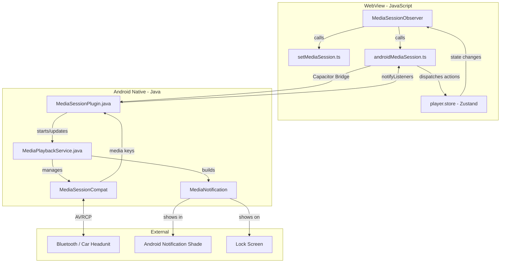
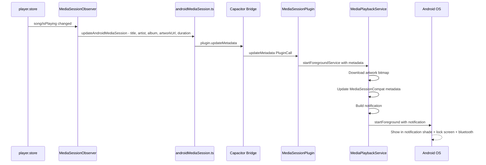
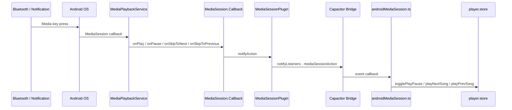

# Android Media Session & Notification Architecture

## Problem Statement

Aonsoku uses HTML5 `<audio>` elements in a Capacitor WebView for audio playback. The Web MediaSession API (`navigator.mediaSession`) is implemented in [`setMediaSession.ts`](src/utils/setMediaSession.ts) and orchestrated by [`MediaSessionObserver`](src/app/observers/media-session-observer.tsx:11), but **does not work in Android WebView**. This means:

- No media notification in the Android notification shade
- No bluetooth media key support (play/pause/skip on headphones, car headunits)
- No lock screen controls
- Audio may be killed when the app is backgrounded

## Approach Evaluation

### Approach A: Community Plugin (`capacitor-music-controls-plugin-v3`)
- **Status**: Last published 2023, targets Capacitor 5. Not compatible with Capacitor 8.
- **Verdict**: ❌ Rejected — outdated, incompatible

### Approach C: `@nicepkg/capacitor-media-session`
- **Status**: Targets Capacitor 5/6. No Capacitor 8 support.
- **Verdict**: ❌ Rejected — incompatible

### Approach B: Custom Capacitor Plugin ✅ RECOMMENDED
- Follows the exact same pattern as [`NavigationBarPlugin.java`](android/app/src/main/java/xyz/bsums/aonsoku/NavigationBarPlugin.java)
- Full control over Android `MediaSessionCompat`, foreground service, and notification
- No external dependency version conflicts
- Can be tailored exactly to the app's needs
- **Verdict**: ✅ Selected

## Architecture Overview



## Detailed Design

### 1. Native Android Side

#### 1.1 `MediaSessionPlugin.java`
**Location**: [`android/app/src/main/java/xyz/bsums/aonsoku/MediaSessionPlugin.java`](android/app/src/main/java/xyz/bsums/aonsoku/MediaSessionPlugin.java)

The Capacitor plugin that bridges JS calls to native Android. Registered in [`MainActivity.java`](android/app/src/main/java/xyz/bsums/aonsoku/MainActivity.java) alongside the existing `NavigationBarPlugin`.

**Plugin Methods** (called from JS):

| Method | Parameters | Description |
|--------|-----------|-------------|
| `updateMetadata` | `title`, `artist`, `album`, `artworkUrl`, `duration` | Sets song metadata on MediaSession and updates notification |
| `updatePlaybackState` | `isPlaying`, `position`, `playbackRate` | Updates play/pause state, seek position |
| `destroy` | none | Stops the foreground service and releases MediaSession |

**Events** (sent to JS via `notifyListeners`):

| Event | Data | Description |
|-------|------|-------------|
| `mediaSessionAction` | `{ action: 'play' \| 'pause' \| 'nexttrack' \| 'previoustrack' \| 'seekto' }` | Media button pressed |

#### 1.2 `MediaPlaybackService.java`
**Location**: [`android/app/src/main/java/xyz/bsums/aonsoku/MediaPlaybackService.java`](android/app/src/main/java/xyz/bsums/aonsoku/MediaPlaybackService.java)

An Android `Service` running as a **foreground service** that:
- Holds the `MediaSessionCompat` instance
- Builds and maintains the media notification via `NotificationCompat.MediaStyle`
- Handles `MediaSessionCompat.Callback` for bluetooth/notification button presses
- Keeps the WebView process alive when backgrounded

**Key components inside the service**:

```
MediaPlaybackService
├── MediaSessionCompat           -- Android media session
├── MediaSessionCompat.Callback  -- Handles onPlay, onPause, onSkipToNext, etc.
├── NotificationCompat.Builder   -- Builds the media notification
├── NotificationChannel          -- Required for Android 8+
└── BitmapLoader                 -- Async artwork download for notification
```

#### 1.3 Notification Design

The notification will use `NotificationCompat.MediaStyle` with:
- **Large icon**: Album art bitmap, downloaded from the cover art URL
- **Content title**: Song title
- **Content text**: Artist name
- **Subtext**: Album name
- **Actions**: Previous, Play/Pause, Next (3 compact actions)
- **MediaStyle**: Attached to the `MediaSessionCompat.Token` for system integration

#### 1.4 Drawable Resources

Small icon drawables needed in [`android/app/src/main/res/drawable/`](android/app/src/main/res/drawable/):
- `ic_notification.xml` — notification small icon (can reuse app icon)
- `ic_play.xml` — play button
- `ic_pause.xml` — pause button  
- `ic_skip_previous.xml` — previous track button
- `ic_skip_next.xml` — next track button

These should be vector drawables for proper scaling.

### 2. JavaScript Side

#### 2.1 `androidMediaSession.ts`
**Location**: [`src/utils/androidMediaSession.ts`](src/utils/androidMediaSession.ts)

A new module that wraps the Capacitor plugin bridge, mirroring the pattern in [`theme.ts`](src/utils/theme.ts:143) for `NavigationBarPlugin`.

```typescript
interface MediaSessionPlugin {
  updateMetadata(options: {
    title: string
    artist: string
    album: string
    artworkUrl: string
    duration: number
  }): Promise<void>

  updatePlaybackState(options: {
    isPlaying: boolean
    position: number
    playbackRate: number
  }): Promise<void>

  destroy(): Promise<void>

  addListener(
    event: 'mediaSessionAction',
    callback: (data: { action: string }) => void
  ): Promise<{ remove: () => void }>
}
```

**Key functions exported**:
- `updateAndroidMediaSession(song)` — sends metadata to native
- `updateAndroidPlaybackState(isPlaying)` — sends play/pause state
- `destroyAndroidMediaSession()` — tears down notification
- `setupAndroidMediaSessionListeners()` — listens for native media button events and dispatches to player store

#### 2.2 Modifications to `MediaSessionObserver`
**Location**: [`src/app/observers/media-session-observer.tsx`](src/app/observers/media-session-observer.tsx)

Add Android-specific calls alongside the existing web MediaSession calls:

```
useEffect:
  if isCapacitor:
    updateAndroidMediaSession(song)
    updateAndroidPlaybackState(isPlaying)
  else:
    manageMediaSession.setMediaSession(song)  // existing web API
```

On mount (once), call `setupAndroidMediaSessionListeners()` to register the native event listener.

### 3. Android Manifest Changes

**Location**: [`android/app/src/main/AndroidManifest.xml`](android/app/src/main/AndroidManifest.xml)

```xml
<!-- New permissions -->
<uses-permission android:name="android.permission.FOREGROUND_SERVICE" />
<uses-permission android:name="android.permission.FOREGROUND_SERVICE_MEDIA_PLAYBACK" />
<uses-permission android:name="android.permission.POST_NOTIFICATIONS" />

<!-- Service declaration inside <application> -->
<service
    android:name=".MediaPlaybackService"
    android:foregroundServiceType="mediaPlayback"
    android:exported="false" />
```

**Notes on permissions**:
- `FOREGROUND_SERVICE` — required for all foreground services
- `FOREGROUND_SERVICE_MEDIA_PLAYBACK` — required on Android 14+ (API 34) for media foreground services
- `POST_NOTIFICATIONS` — required on Android 13+ (API 33); must be requested at runtime

### 4. Gradle Dependencies

**Location**: [`android/app/build.gradle`](android/app/build.gradle)

Add `androidx.media` for `MediaSessionCompat`:

```groovy
implementation 'androidx.media:media:1.7.0'
```

### 5. MainActivity Registration

**Location**: [`android/app/src/main/java/xyz/bsums/aonsoku/MainActivity.java`](android/app/src/main/java/xyz/bsums/aonsoku/MainActivity.java)

```java
registerPlugin(NavigationBarPlugin.class);  // existing
registerPlugin(MediaSessionPlugin.class);   // new
```

## Data Flow

### Song Change Flow



### Media Button Press Flow



## Background Audio Handling

### The WebView Audio Problem

When a Capacitor app is backgrounded, Android may suspend the WebView process. The HTML5 `<audio>` element lives in the WebView, so it could stop playing.

### Solution: Foreground Service + WebView Settings

1. **Foreground Service**: `MediaPlaybackService` runs as a foreground service with `foregroundServiceType="mediaPlayback"`. This tells Android the app is actively playing media and should not be killed.

2. **WebView Keep-Alive**: The Capacitor WebView continues running because the app process is kept alive by the foreground service. The `<audio>` element continues playing in the background.

3. **Audio Focus**: The `MediaSessionCompat` handles audio focus automatically. When another app requests audio focus, the callback fires and we can pause playback.

4. **Lifecycle**: 
   - Service starts when first song plays (metadata is sent)
   - Service updates on song change or play/pause
   - Service stops when `destroy()` is called (e.g., user stops playback completely)

### Important: No Native Audio Player Needed

The actual audio decoding/streaming stays in the WebView `<audio>` element. The native side only handles:
- Media session metadata (for notifications/bluetooth)
- Foreground service (to keep the process alive)
- Media button callbacks (forwarded back to JS)

This is the simplest approach and avoids duplicating audio playback logic.

## File Structure Summary

### New Files

```
android/app/src/main/java/xyz/bsums/aonsoku/
├── MediaSessionPlugin.java          -- Capacitor plugin bridge
└── MediaPlaybackService.java        -- Foreground service + MediaSession

android/app/src/main/res/drawable/
├── ic_media_play.xml                -- Play button vector drawable
├── ic_media_pause.xml               -- Pause button vector drawable
├── ic_media_previous.xml            -- Previous track vector drawable
└── ic_media_next.xml                -- Next track vector drawable

src/utils/
└── androidMediaSession.ts           -- JS bridge wrapper + event handling
```

### Modified Files

```
android/app/src/main/AndroidManifest.xml     -- Add permissions + service
android/app/build.gradle                      -- Add androidx.media dependency
android/app/src/main/java/.../MainActivity.java -- Register new plugin
src/app/observers/media-session-observer.tsx   -- Add Android-specific calls
src/utils/setMediaSession.ts                   -- Optional: extract shared logic
```

## Bluetooth / Car Headunit Support

Bluetooth media controls work automatically through `MediaSessionCompat`:

- **AVRCP Protocol**: Android's `MediaSessionCompat` automatically exposes metadata and playback controls via Bluetooth AVRCP (Audio/Video Remote Control Profile)
- **Car Headunits**: Android Auto and standard Bluetooth car systems read from the active `MediaSession`
- **Media Keys**: Physical media buttons on bluetooth headphones/earbuds trigger `MediaSessionCompat.Callback` methods
- **No extra code needed**: Once `MediaSessionCompat` is properly configured with metadata and playback state, all bluetooth integrations work automatically

## Runtime Permission Handling

On Android 13+ (API 33), `POST_NOTIFICATIONS` requires runtime permission. Options:

1. **Request on first play**: When the user first plays a song, request the notification permission before starting the foreground service
2. **Graceful degradation**: If permission is denied, the foreground service still works but the notification won't be visible. Bluetooth controls still work because `MediaSessionCompat` doesn't require notification permission.

The JS side should handle this via the Capacitor plugin:

```typescript
// In MediaSessionPlugin.java - check/request permission before showing notification
if (Build.VERSION.SDK_INT >= 33) {
    requestPermissionForAlias("notifications", call, "notificationPermissionCallback");
}
```

## Edge Cases & Considerations

1. **Album Art Loading**: Cover art URLs point to the Navidrome/Subsonic server. The native service must download the bitmap asynchronously. Use a placeholder while loading.

2. **Multiple Audio Sources**: The app supports songs, podcasts, and radio. Each has different metadata shapes — the JS adapter layer normalizes these before sending to native.

3. **Service Lifecycle**: The service should stop when:
   - The user explicitly stops playback and clears the queue
   - The user swipes away the notification (if allowed)
   - The app is force-stopped

4. **Notification Channel**: Must create a notification channel on Android 8+ (API 26). Since `minSdkVersion` is 24, we need the channel creation code.

5. **Audio Focus**: Handle `AUDIOFOCUS_LOSS` to pause, `AUDIOFOCUS_GAIN` to resume. This ensures good behavior with other media apps.
